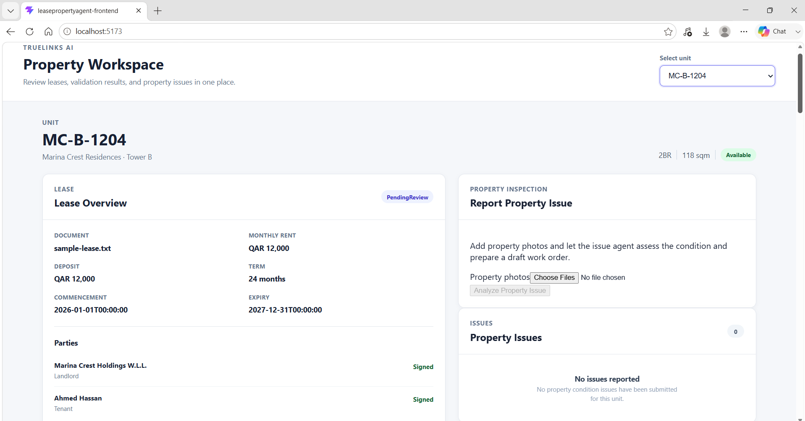
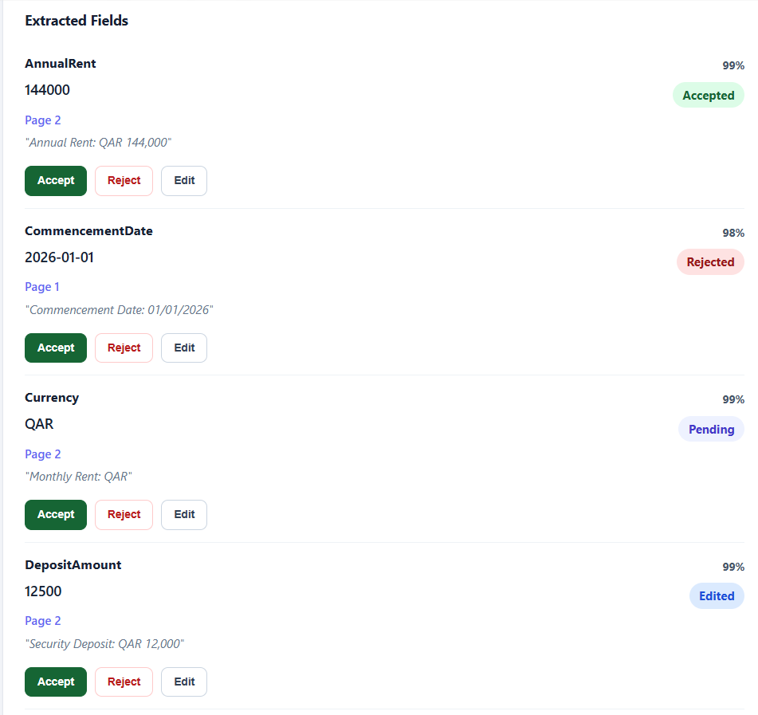
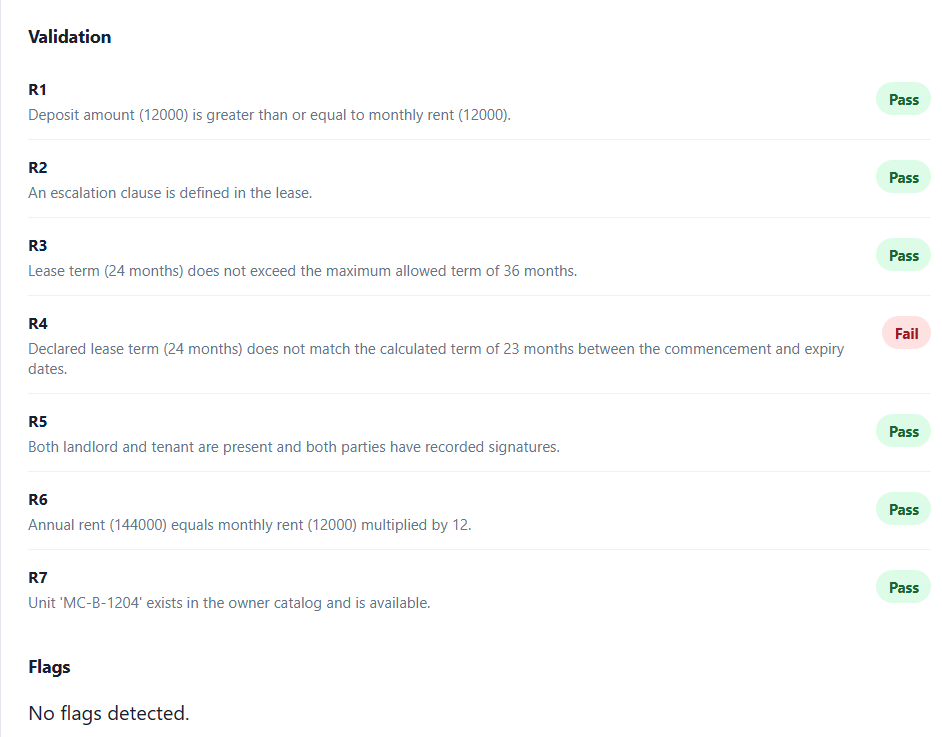

# Lease & Property Intelligence Agent

A full-stack AI-assisted property operations workspace that converts lease documents and property issue images into structured, traceable, and human-reviewable operational data.

The application demonstrates how AI agents can support property management teams by extracting lease information, validating it against owner-defined rules, identifying visible property issues, and preparing draft work orders for human approval.

## Features

### Lease document intelligence

- Extracts structured lease information from lease documents.
- Identifies:
  - Landlord and tenant
  - Unit number
  - Commencement and expiry dates
  - Lease term
  - Monthly and annual rent
  - Currency and rent frequency
  - Deposit amount
  - Escalation clause
  - Renewal terms
  - Termination terms
- Preserves source evidence for extracted fields:
  - Source page
  - Supporting source text
  - Extraction confidence
- Detects missing or inconsistent information.
- Matches the extracted unit against the property unit catalog.
- Links the lease to the matching unit only when the unit can be safely identified.

### Rule-based lease validation

Extracted lease information is validated against the owner ruleset.

Each rule returns one of:

- `PASS`
- `FAIL`
- `NOT_DETERMINABLE`

Each validation result includes a reason and source evidence where available.

Current rules include:

| Rule | Description |
|---|---|
| R1 | Deposit must be greater than or equal to monthly rent |
| R2 | Escalation clause must be defined |
| R3 | Lease term must not exceed 36 months |
| R4 | Expiry date and declared term must be consistent |
| R5 | Landlord and tenant must be present and signed |
| R6 | Annual rent must equal monthly rent multiplied by 12 |
| R7 | Unit must exist in the catalog and be available |

### Property issue intelligence

- Accepts property image references.
- Produces a condition assessment.
- Records image-level observations.
- Identifies visible fixtures, surfaces, or equipment where possible.
- Generates a draft work order containing:
  - Work-order title
  - Description of the issue
  - Affected unit
- Stores issue images, observations, confidence, and work-order information.

### Human-in-the-loop review

Users can review and act on AI-generated results.

Supported actions include:

- Accept extracted lease fields
- Reject extracted lease fields
- Edit extracted lease fields
- Accept detected lease flags
- Reject detected lease flags
- Dismiss lease flags
- Accept work orders
- Reject work orders
- Edit work orders

Review actions are persisted and recorded in an audit table with:

- Entity type
- Entity ID
- Action
- Previous value
- New value
- Reason
- Timestamp

### Unit workspace

The application provides a unit-centered workspace that displays:

- Unit information
- Building and property details
- Associated lease
- Extracted lease fields
- Validation results
- Lease flags
- Property issues
- Issue images
- Draft work orders
- Human review controls

This allows a property manager to view the lease and operational issues for the same unit in one place.
## Application Preview
### Property workspace



The unit-centered workspace displays property details, lease information, validation results, property issues, and draft work orders.

### Lease extraction and human review



Extracted lease fields include confidence, source evidence, and actions for accepting, editing, or rejecting the proposed value.

### Lease validation



The validation panel evaluates extracted lease information against the owner-defined ruleset and displays the result and reason for each rule.

### Property issue review

.png)

### Property issue and work-order review  

.png)

The issue workflow presents the condition assessment and generated work order, allowing a human reviewer to accept, reject, or edit the draft.
## Architecture

The solution is organized into separate layers to keep business logic, infrastructure, and API concerns isolated.

```text
LeasePropertyAgent
│
├── LeasePropertyAgent.Api
│   └── HTTP controllers and application startup
│
├── LeasePropertyAgent.Application
│   ├── Application services
│   ├── Agent interfaces
│   ├── DTOs and request models
│   ├── Validation services
│   ├── Review services
│   └── Repository interfaces
│
├── LeasePropertyAgent.Domain
│   ├── Property
│   ├── Building
│   ├── Unit
│   ├── Lease
│   ├── Issue
│   ├── WorkOrder
│   └── ReviewAction
│
├── LeasePropertyAgent.Infrastructure
│   ├── EF Core DbContext
│   ├── SQLite persistence
│   ├── Repositories
│   ├── JSON catalog providers
│   ├── Document extraction
│   ├── Lease agent implementation
│   └── Property issue agent implementation
│
├── LeasePropertyAgent.Tests
│   └── Unit, integration, persistence, and API tests
│
├── LeasePropertyAgent.Frontend
│   └── React/Vite user interface
│
└── data
    ├── units.json
    ├── owner_ruleset.json
    └── sample-lease.txt
```

### Dependency direction

```text
API
 ↓
Application
 ↓
Domain

Infrastructure implements Application interfaces.
Infrastructure depends on Application and Domain.
```

This structure makes it possible to replace the current stub AI implementations with real document, language, or vision models without rewriting the core business workflows.

## Agent workflows

### Lease agent workflow

```text
Lease document
    ↓
Document extraction
    ↓
Structured lease extraction
    ↓
Source evidence and confidence
    ↓
Missing/contradiction detection
    ↓
Unit matching
    ↓
Owner-rule validation
    ↓
Persistence
    ↓
Human review in the workspace
```

### Property issue agent workflow

```text
Property image references
    ↓
Image assessment
    ↓
Visible observations and confidence
    ↓
Condition assessment
    ↓
Draft work order
    ↓
Persistence
    ↓
Human accept/reject/edit review
```

## AI implementation and trade-offs

The project uses interfaces around the document extractor and agent implementations.

The current implementation includes deterministic stub agents designed to demonstrate the complete workflow without requiring an external AI API key.

This was intentional for the exercise because it allows the application to demonstrate:

- Agent boundaries
- Structured output
- Evidence traceability
- Confidence values
- Validation
- Persistence
- Human review
- Audit history
- Testability

The following interfaces isolate the model-dependent parts of the system:

- `IDocumentExtractor`
- `ILeaseAgent`
- `IIssueAgent`

A production implementation could replace the stub implementations with:

- An OCR/document parsing service
- A large language model for structured lease extraction
- A vision-language model for property image analysis
- A schema-constrained JSON response pipeline
- A retrieval layer for document evidence
- A model confidence and quality monitoring system

The application should not treat model output as authoritative. Extracted values are stored as proposed information and remain subject to validation and human review.

## Human review and traceability

AI-generated information is separated from reviewed information.

For example, lease fields contain:

- Original extracted value
- Optional reviewed value
- Extraction confidence
- Source page
- Source text
- Review status

This makes it possible to distinguish between:

1. What the agent extracted
2. What the rules engine determined
3. What a human accepted or changed

This separation is important for operational systems because AI output may be incomplete, ambiguous, or incorrect.

## Technology stack

### Backend

- C#
- .NET 8
- ASP.NET Core Web API
- Entity Framework Core
- SQLite
- xUnit
- ASP.NET Core integration testing

### Frontend

- React
- Vite
- Axios
- JavaScript
- CSS

### Data

- SQLite for application persistence
- JSON files for:
  - Unit catalog
  - Owner ruleset
  - Sample lease document

## Running the project locally

### Prerequisites

Install:

- .NET 8 SDK
- Node.js 18 or later
- npm
- Git

### Clone the repository

```bash
git clone <YOUR_REPOSITORY_URL>
cd LeasePropertyAgent
```

Replace `<YOUR_REPOSITORY_URL>` with the URL of this GitHub repository.

### Run the backend

From the solution root:

```powershell
dotnet restore
dotnet build
dotnet run --project .\LeasePropertyAgent.Api
```

The API runs at:

```text
http://localhost:5184
```

On startup, the application:

1. Creates the SQLite database if required.
2. Loads the unit catalog from `data/units.json`.
3. Seeds properties, buildings, and units into SQLite.

### Run the frontend

Open a second terminal:

```powershell
cd .\LeasePropertyAgent.Frontend
npm install
npm run dev
```

The frontend runs at:

```text
http://localhost:5173
```

The frontend is configured to call the backend API at:

```text
http://localhost:5184/api
```

## Sample workflow

### Lease processing

The sample lease document is located at:

```text
data/sample-lease.txt
```

The lease processing endpoint is:

```http
POST /api/leases/process
```

Example request:

```json
{
  "documentPath": "D:\\LeasePropertyAgent\\data\\sample-lease.txt"
}
```

The endpoint extracts the lease, matches the unit, validates the lease, and persists the result.

### Unit listing

```http
GET /api/units
```

### Unit workspace

```http
GET /api/units/{unitId}/workspace
```

The workspace endpoint returns the unit, property, building, lease, issues, validation results, source evidence, and review statuses required by the frontend.

### Property issue processing

```http
POST /api/issues/process
```

Example request:

```json
{
  "unitId": "UNIT_GUID",
  "images": [
    {
      "fileName": "living-room-wall.jpg",
      "filePath": "images/living-room-wall.jpg"
    }
  ]
}
```

### Review endpoints

#### Lease field review

```http
POST /api/reviews/lease-fields/{fieldId}
```

#### Lease flag review

```http
POST /api/reviews/lease-flags/{flagId}
```

#### Work-order review

```http
POST /api/reviews/work-orders/{workOrderId}
```

## Testing

Run all backend tests from the solution root:

```powershell
dotnet test
```

The project currently contains coverage for:

- Domain and application behavior
- Document extraction
- Lease agent extraction
- Lease validation
- Unit matching
- Lease persistence
- Issue processing
- Issue persistence
- Review service behavior
- Review API endpoints
- Unit listing API
- Unit workspace API
- Integration test database behavior

The latest verified test result:

```text
Total tests: 92
Passed: 92
Failed: 0
Skipped: 0
```

The integration tests use isolated temporary SQLite databases and deterministic schema setup to avoid test-order and database-sharing issues.

### Frontend checks

From the frontend directory:

```powershell
npm run lint
npm run build
```

## Project decisions

### SQLite instead of SQL Server

SQLite was selected because it is lightweight, requires no separate database server, and makes the project easy to run locally.

For production, the persistence layer could be moved to PostgreSQL, SQL Server, or another managed relational database with minimal impact on the application layer.

### JSON files for catalog and rules

The unit catalog and owner ruleset are stored as JSON fixtures to keep the exercise self-contained and easy to evaluate.

In a production environment, these could be managed through:

- A property management database
- An owner configuration service
- An administrative rules interface
- Versioned configuration records

### Stub agents

The current agents demonstrate the complete workflow without external API credentials.

A production version would require:

- Model API credentials
- Document and image storage
- OCR or multimodal model integration
- Input/output schema validation
- Retry and timeout handling
- Model monitoring
- Prompt/version management
- Cost controls
- Privacy and data-retention policies

### File-path based document processing

The current sample workflow accepts a local document path. A production application would normally accept uploaded files through an authenticated upload endpoint and store them in object storage such as Azure Blob Storage, Amazon S3, or another managed storage service.

## Current limitations

This project is a focused technical exercise rather than a complete production property-management platform.

Current limitations include:

- Stub document and image agents instead of live AI models
- Local file-path document processing
- SQLite persistence
- No authentication or authorization
- No multi-tenant security model
- No production file storage
- No background job queue
- No model monitoring or evaluation dashboard
- No advanced document OCR pipeline
- No image upload storage pipeline
- No notification or assignment workflow
- No full lease lifecycle management
- No production deployment configuration

## Future improvements

Potential next steps include:

### AI and extraction

- Integrate a real document intelligence or multimodal model.
- Use structured JSON schema responses.
- Add OCR and scanned-PDF support.
- Add page-level bounding boxes for stronger evidence traceability.
- Add confidence calibration and extraction quality metrics.
- Add human feedback loops for improving prompts and extraction accuracy.

### Property operations

- Add real image uploads and object storage.
- Detect recurring issues across units.
- Add work-order assignment and technician status.
- Add priority, SLA, and estimated repair cost.
- Add issue history and maintenance trends.

### Platform capabilities

- Add authentication and role-based access control.
- Add owner, property, building, and unit administration.
- Add PostgreSQL or SQL Server support.
- Add background processing for large document batches.
- Add audit history views.
- Add notification integrations.
- Add deployment pipelines and environment-based configuration.

## Product value

The workflow is designed to reduce manual property administration by turning unstructured information into operational records.

Potential benefits include:

- Faster lease onboarding
- Earlier detection of missing or inconsistent lease terms
- More reliable unit-to-lease matching
- Better visibility into property condition
- Faster work-order preparation
- Clearer accountability through human review
- Improved auditability of AI-assisted decisions

The key product principle is that AI proposes and explains information, while business rules and human reviewers remain responsible for operational decisions.

## Submission

This repository contains the full-stack implementation, backend tests, frontend workspace, sample data, and documentation required to run and evaluate the project locally.
